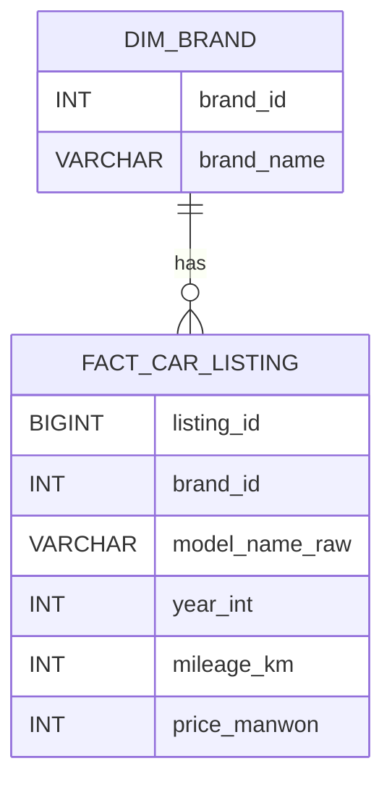

# 데이터 기반 중고차 구매 의사결정 지원 서비스

---

## 팀 구성

| 이름 | 역할 |
|------|------|
| 장한재 | 웹크롤링·데이터 분석 · 서비스 설계 · Streamlit 구현 |
| 박민선 |  |
| 홍완기 |  |
| 조동휘 | |
| 임승현 |  |
| 윤찬호 |  |

---

## 1. 프로젝트 개요

### 1.1 프로젝트 요약

본 프로젝트는 사용자가 구매를 고려 중인 중고차의 가격이 시장 기준에서 합리적인 수준인지 분석하고, 동일 조건 내에서 더 나은 선택 가능성이 존재하는지를 제시하는 데이터 기반 의사결정 지원 서비스이다.

기존 중고차 플랫폼은 매물 조회 및 단순 정렬 기능 중심으로 구성되어 있으며, 구매 의사결정 단계에서 필요한 해석 정보 제공에는 한계가 존재한다. 본 서비스는 이러한 한계를 보완하기 위해 비교·분석·해석 중심 구조로 설계되었다.

---

### 1.2 문제 정의

중고차 구매자는 특정 차량을 선택한 이후에도 다음과 같은 불확실성을 경험한다.

- 현재 가격이 시장 대비 적정한가  
- 동일 조건 대비 더 나은 선택지가 존재하는가  
- 구매 이후 가격 측면의 후회 가능성이 존재하는가  

본 프로젝트는 위 세 가지 질문에 데이터 기반으로 답하는 것을 목표로 한다.

---

## 2. 서비스 설계 철학

본 서비스는 단순 조회 서비스가 아닌 의사결정 지원 시스템으로 설계되었다.

핵심 설계 원칙은 다음과 같다.

1. 비교 가능한 군집 내에서 판단한다.  
2. 시장 감가 구조를 반영한다.  
3. 해석 가능한 모델만 사용한다.  
4. 결과는 시각적으로 직관적으로 제시한다.

---

## 3. 핵심 기능

| 구분 | 기능 | 설명 |
|------|------|------|
| 가격 적정도 분석 | 기대가격 대비 위치 판단 | 시장 가격 대비 적정성 평가 |
| 유사 군집 분석 | 동일 조건 매물 탐색 | 연식·주행거리 기반 |
| 시각화 | 가격차이 분포 | 히스토그램 |
| 대안 제시 | 합리적 매물 탐색 | 군집 내 가격 효율 비교 |
| 추천 탐색 | 가성비 매물 추천 | 환산주행 기반 |

---

## 4. 시스템 아키텍처

```
보배드림 크롤링 → MySQL → Python 분석 → Streamlit 서비스
```

데이터 수집, 저장, 분석, 시각화 단계를 분리하여 확장성과 유지보수성을 확보하였다.

---

## 5. 데이터 수집 및 정제

### 5.1 데이터 출처

- 보배드림 중고차 매물 크롤링

### 5.2 수집 항목

- 브랜드  
- 모델명  
- 연식  
- 주행거리  
- 가격  
- 연료  
- 지역  

### 5.3 전처리

- 가격 숫자화  
- 주행거리 단위 통일  
- 연식 정수 변환  
- 결측치 제거  

---

## 6. 데이터베이스 설계



브랜드는 정규화를 통해 중복 및 갱신 이상을 방지하였다.

---

## 7. 데이터 파이프라인

```
크롤링
 → Raw 저장
 → 정규화
 → 분석 데이터셋 생성
 → 유사도 군집
 → 기대가격 산출
 → 시각화 서비스
```

---

## 8. 유사도 군집 모델

동일 모델 기준 매물을 대상으로 다음 변수 차이를 활용한다.

- 연식  
- 주행거리  

---

## 9. 연식–주행거리 가중치 설정 근거

선행 연구에 따르면:

- 연식 1년 증가 → 약 7.4% 가격 하락  
- 주행거리 10,000km 증가 → 약 3.3% 가격 하락  

환산 결과:

```
연식 1년 ≈ 22,000km
```

이를 감가 단위로 적용하였다.

---

## 10. 거리 함수

```
distance =
|연식 차이| +
|주행거리 차이| / 22,000
```

---

## 11. 유사도 함수

```
similarity = exp(-distance)
```

---

## 12. 기대가격 모델

군집 내 회귀 분석:

```
Price = β0 + β1·Year + β2·Mileage
```

가격 예측이 아닌 비교 기준선 역할 수행.

---

## 13. 가격 적정도 판단

```
가격차이 = 실제 − 기대
```

| 구간 | 의미 |
|------|------|
| Q1 이하 | 저평가 |
| Q1~Q3 | 적정 |
| Q3 이상 | 고평가 |

---

## 14. 대안 차량 제시 로직

선정 기준:

```
price_gap(매물) < price_gap(입력 차량)
```

상위 3개 매물 제시.

---

## 15. 추천 탐색 모델

```
환산주행거리 =
(연식 × 22,000) + 주행거리
```

---

## 16. 시각화 설계

- 가격차이 히스토그램  
- 내 차량 위치 표시  
- 중앙값 표시  

---

## 17. 서비스 UI 흐름

1. 차량 선택  
2. 가격 분석  
3. 적정도 판단  
4. 대안 제시  
5. 추천 탐색  

---

## 18. GitHub 폴더 구조

```
project/
├─ analysis/
├─ streamlit/
├─ data/
├─ crawler/
└─ README.md
```

---

## 19. 프로젝트 차별성

- 의사결정 지원 중심 설계  
- 연구 기반 감가 가중치  
- 설명 가능한 모델  

---

## 20. 한계점

- 옵션 반영 한계  
- 사고 이력 미반영  

---

## 21. 확장 방향

- 옵션 반영  
- 지역 가격 반영  
- 딥러닝 가격모델  

---

## 결론

본 서비스는 시장 비교 분석을 통해 중고차 구매 의사결정을 지원하는 데이터 기반 분석 시스템이다.
