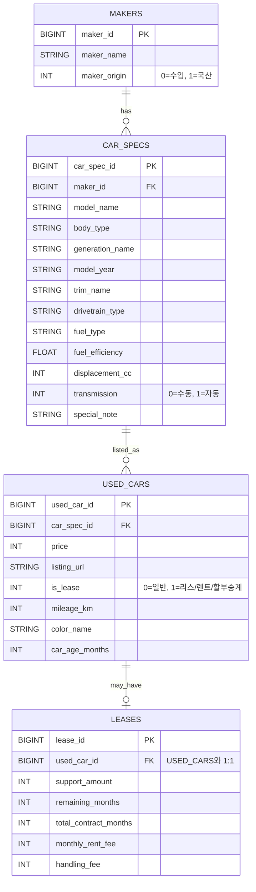

# 데이터 기반 중고차 구매 의사결정 지원 서비스

---

## 팀 구성

| 이름 | 역할 |
|------|------|
| 장한재 | 웹크롤링·데이터 분석 · 서비스 설계 · Streamlit 구현 |
| 박민선 |  |
| 홍완기 |  |
| 조동휘 | |
| 임승현 |  |
| 윤찬호 |  |

---

## 1. 프로젝트 개요

### 1.1 프로젝트 요약

본 프로젝트는 사용자가 구매를 고려 중인 중고차의 가격이 시장 기준에서 합리적인 수준인지 분석하고, 동일 조건 내에서 더 나은 선택 가능성이 존재하는지를 제시하는 데이터 기반 의사결정 지원 서비스이다.

기존 중고차 플랫폼은 매물 조회 및 단순 정렬 기능 중심으로 구성되어 있으며, 구매 의사결정 단계에서 필요한 해석 정보 제공에는 한계가 존재한다. 본 서비스는 이러한 한계를 보완하기 위해 비교·분석·해석 중심 구조로
설계되었다.

---

### 1.2 문제 정의

중고차 구매자는 특정 차량을 선택한 이후에도 다음과 같은 불확실성을 경험한다.

- 현재 가격이 시장 대비 적정한가
- 동일 조건 대비 더 나은 선택지가 존재하는가
- 구매 이후 가격 측면의 후회 가능성이 존재하는가

본 프로젝트는 위 세 가지 질문에 데이터 기반으로 답하는 것을 목표로 한다.

---

### 1.3 프로젝트 실행
#### 1.3.1 환경설정 파일 생성 및 확인
`mysql`폴더 안에 `.env`파일을 생성한 후에 아래의 예시대로 작성해야 한다.
```.env
MYSQL_ROOT_PASSWORD='DataBase Root계정 비밀번호'
MYSQL_DATABASE=used_car_db
TZ=Asia/Seoul
```

#### 1.3.2 docker-compose 실행
프로젝트 폴더의 최상단 위치에서 아래의 명령어를 실행한다.
```bash
docker-compose -p SKN26-1ST-1TEAM up 
```
- `-p SKN26-1ST-TEAM`: Docker Compose의 프로젝트 이름 지정
- 컨테이너, 네트워크, 저장소 이름이 SKN26-1ST-1TEAM_* 형태로 생성됨

정상적으로 실행되면 MySQL 컨테이너가 실행되고
`used_car_db`데이터베이스가 자동으로 초기화된다.

## 2. 서비스 설계 철학

본 서비스는 단순 조회 서비스가 아닌 의사결정 지원 시스템으로 설계되었다.

핵심 설계 원칙은 다음과 같다.

1. **비교 가능한 군집 내에서 판단한다.**  
   - 가격 비교는 동일/유사 조건의 차량 집합을 기준으로 수행해야 해석이 가능하다.  
2. **시장 감가 구조를 반영한다.**  
   - 연식과 주행거리는 가격 감가의 핵심 요인이므로, 이를 유사도 거리 정의에 반영한다.  
3. **설명 가능한 모델만 사용한다.**  
   - 복잡한 모델보다 해석 가능한 거리 함수, 회귀, 분위수 기반 판정을 채택한다.  
4. **결과는 직관적으로 제시한다.**  
   - 사용자가 “내 차량이 분포에서 어디에 있는지”를 한눈에 이해하도록 시각화를 설계한다.  
5. **대안 제시는 ‘최저가’가 아닌 ‘합리성’ 기준으로 정의한다.**  
   - 단순 최저가는 상태 열화(연식/주행) 등으로 왜곡될 수 있으므로, 군집 내 기대가격 대비 효율로 대안을 정의한다.
1. 비교 가능한 군집 내에서 판단한다.
2. 시장 감가 구조를 반영한다.
3. 해석 가능한 모델만 사용한다.
4. 결과는 시각적으로 직관적으로 제시한다.

---

## 3. 핵심 기능

| 구분        | 기능            | 설명              |
|-----------|---------------|-----------------|
| 가격 적정도 분석 | 기대가격 대비 위치 판단 | 시장 가격 대비 적정성 평가 |
| 유사 군집 분석  | 동일 조건 매물 탐색   | 연식·주행거리 기반      |
| 시각화       | 가격차이 분포       | 히스토그램           |
| 대안 제시     | 합리적 매물 탐색     | 군집 내 가격 효율 비교   |
| 추천 탐색     | 가성비 매물 추천     | 환산주행 기반         |

---

## 4. 시스템 아키텍처

```
보배드림 크롤링 → MySQL → Python 분석 → Streamlit 서비스
```

데이터 수집, 저장, 분석, 시각화 단계를 분리하여 확장성과 유지보수성을 확보하였다.

---

## 5. 데이터 수집 및 정제

### 5.1 데이터 출처

- 보배드림 중고차 매물 크롤링

### 5.2 수집 항목
-  차량 제원 관련
   - 제조사 
   - 모델명
   - 세대명
   - 트림(등급)
   - 연료 타입
   - 변속기
   - 구동 방식
   - 배기량 / 전비
   - 연비
- 매물 관련 (UsedCar)
  - 가격
  - 주행거리
  - 연식(또는 최초 등록 연월)
  - 색상
  - 매물 링크(URL)
  - 리스 여부
  - 차령(개월)
- 리스 관련 (Lease, 선택)
  - 승계지원금
  - 월 리스료
  - 잔여 계약 개월
  - 총 계약 개월

### 5.3 전처리
- 수치 정규화
  - 가격, 주행거리, 배기량의 콤마 제거 및 정수 변환
  - 연비/전비 숫자 추출
  - 리스 금액 관련 문자열 → 숫자 변환

- 도메인 전처리
  - 연식 → 차령(개월) 계산
  - 리스 여부 플래그(is_lease) 생성
  - 리스 매물만 Lease 데이터 분리

- 텍스트/범주 처리
  -연료 타입 표준화 (예: 가솔린/휘발유 통합)
  - 변속기 표준화 (자동/수동)
  - 색상 명칭 정규화

- 데이터 품질 
  - 중복 매물 제거 (URL 기준)
  - 필수 컬럼 결측치만 제거

---

## 6. 데이터베이스 설계

### 6.1 개념 모델 설계
#### 요구 정의서
- 본 프로젝트는 중고차 데이터를 **제조사(Maker)–차량 제원(CarSpec)–매물(UsedCar)** 흐름으로 관리한다.
- **리스 정보는 일부 매물에서만 제공되는 부가 정보**이므로 Lease로 별도 관리한다.

#### 6.1.1 개념 엔티티 정의
- **제조사**: 차량을 **생산하는 주체**이다.   
  제조사를 식별하고 분류하기 위한 기준 정보를 대표한다.
- **차량 제원**: 차량 모델의 세대·트림을 포함한 **고정된 차량 특성**을 나타낸다.   
  연료 방식, 구동 방식 등 매물과 무관한 스펙 정보를 대표한다.
- **중고차 매물**: 실제로 거래되는 중고차 단위이다.   
가격, 상태, 주행 이력 등 **매물마다 달라지는 정보를 대표**한다.
- **리스 정보**: 리스·렌트·할부 승계 매물에 한해 발생하는 계약 관련 부가 정보를 대표한다.   
  **일반 매물에는 존재하지 않는다.**

#### 6.1.2 개념 관계
- **제조사 1 : N 차량 제원**   
  하나의 제조사는 여러 차량 제원을 가질 수 있다.   
  차량 제원은 반드시 하나의 제조사에 속한다.
- **차량 제원 1 : N 중고차 매물**   
  하나의 차량 제원은 여러 중고차 매물로 등록될 수 있다.   
  각 매물은 하나의 차량 제원을 기준으로 한다.
- **중고차 매물 1 : 0..1 리스 정보**   
  리스 정보는 모든 매물에 존재하지 않는다.  
  리스/승계 매물에 한해 **선택적으로 연결**된다.

---

### 6.2 논리 모델 설계



중고차 데이터는 차량의 고정 제원과 매물별 변동 정보가 명확히 구분되는 도메인을 가진다.
이에 따라 제원 정보와 매물 정보를 분리하였다.
리스 정보는 선택적으로 존재하는 부가 정보로 설계하였다.

정규화 과정을 통해 **제조사(브랜드)와 차량 제원 정보를 분리**하여   
데이터 중복을 제거하고 **갱신•삭제 이상을 방지**하였다.

리스 정보는 모든 매물에 존재하지 않는 **선택적 데이터**이으로   
USED_CARS-LEASES 관계를 1:0..1로 모델링하였다.

---

### 6.3 물리 모델 설계

#### 6.3.1 데이터 베이스 ERD
](./docs/used_car_db.png)
> 차량의 고정 제원과 매물 정보를 분리하여 중복을 제거하였다.  
> 리스 정보는 일부 매물에만 존재하는 선택적 데이터이므로 별도 테이블로 설계하였다.

---

## 7. 데이터 파이프라인

```
크롤링
 → Raw 저장
 → 정규화(MySQL)
 → 분석 데이터셋 생성(pandas)
 → 유사도 군집 구성
 → 기대가격 산출(회귀)
 → 가격 적정도 판정(분위수)
 → 시각화(Streamlit)
```

서비스 실행 시 DB에서 데이터를 로딩하고, 사용자의 입력(브랜드/모델/연식/주행/가격)에 따라 **동적으로 군집과 지표를 계산**하는 형태로 구현하였다.

---

## 8. 유사도 기반 군집화 모델 설계

본 프로젝트는 실제 중고차 매물 데이터를 기반으로 분석을 수행하였으나, 특정 모델 단위로 유사 군집을 구성할 경우 표본 수가 제한되는 문제가 존재하였다. 동일 브랜드·동일 모델을 기준으로 연식과 주행거리까지 유사한 조건을 동시에 만족하는 매물 수는 모델별로 큰 편차를 보였으며, 일부 군집에서는 회귀 계수를 안정적으로 추정하기에 충분한 표본을 확보하기 어려웠다.

일반적인 회귀 분석에서는 표본 수가 충분할 경우 데이터로부터 계수를 직접 추정하는 것이 바람직하지만, 본 프로젝트의 목적은 가격 ‘예측’이 아니라 유사 차량 간 비교 기준선 설정에 있다. 따라서 제한된 표본 규모 하에서 군집별 회귀 계수를 개별적으로 추정할 경우, 특정 군집의 표본 편향이 계수 왜곡으로 이어질 위험이 존재하였다.

이러한 한계를 보완하기 위해 본 프로젝트에서는 선행 연구에서 반복적으로 검증된 감가 계수 비율을 참조하여, 연식과 주행거리 간 상대적 감가 효과를 룰 기반 계수(rule-based coefficient) 형태로 채택하였다. 이는 데이터 제약 환경에서도 비교 기준선의 일관성과 안정성을 확보하기 위한 설계 판단에 따른 것이다.

해당 설계는 다음과 같은 근거에 기반한다.

1. 연구 문헌에서 일관되게 관측되는 감가 계수 비율 존재  
2. 군집별 소표본 편향 위험 완화  
3. 비교 기준선의 구조적 안정성 확보  
4. 가격 ‘예측’이 아닌 ‘비교’ 목적에 부합  

따라서 본 서비스의 회귀 모델은 데이터 기반 최적 계수 추정 모델이라기보다, 선행 연구 근거와 시장 감가 관행을 반영한 설명 가능한 기준선 생성 모델로 해석하는 것이 적절하다.

한편, 본 프로젝트에서 군집(cluster)은 통계적 비지도 학습 결과가 아닌, 시장 비교 가능성을 확보하기 위해 설계된 룰 기반 유사도 군집으로 정의된다. 중고차 감가 구조를 반영한 설명 가능한 유사도 거리 척도를 직접 설계함으로써, 서비스 사용자가 “왜 이 매물들이 비교군으로 구성되었는가”를 이해할 수 있도록 하였다.

### 8.1 군집(비교군) 구성 원칙

군집은 다음 조건을 만족하는 매물 집합으로 구성된다.

1) **동일 브랜드 및 동일 모델(대분류)**  
- 입력 차량과 비교군이 모델 수준에서 일치해야 한다.  
- 트림/옵션 표기 때문에 모델명이 과도하게 세분되는 문제를 완화하기 위해, 분석 키를 “대분류 모델(model_family)”로 구성한다.

2) **연식 및 주행거리 기반 ‘유사도’ 정렬**  
- 동일 모델 내에서도 연식과 주행거리가 크게 다르면 가격 비교가 왜곡된다.  
- 따라서 연식/주행거리 차이를 감가 단위로 환산한 거리(distance)를 정의하고, 이를 유사도(similarity)로 변환하여 가까운 차량일수록 군집의 핵심으로 작동하도록 한다.

3) **비교군 최소 크기 조건**  
- 분포 기반 판정(Q1/Q3)을 안정적으로 수행하기 위해 비교군(군집) 매물 수가 일정 수준 이상이어야 한다.  
- 본 서비스는 최소 10개 이상 비교군을 확보하는 것을 기본 조건으로 둔다(소표본 분포 왜곡 방지 목적).

### 8.2 군집화를 ‘설명 가능한 방식’으로 설계한 이유

- 구매 의사결정 서비스는 결과뿐 아니라 “근거”가 중요하다.  
- 예측 정확도만 높고 해석이 어려운 모델은 사용자 신뢰를 확보하기 어렵다.  
- 따라서 유사도 군집의 정의(브랜드/모델/연식/주행거리)와 가중치 근거(선행 연구)를 문서화하고, 서비스 화면에서 동일한 기준으로 일관되게 사용한다.

---

## 9. 연식–주행거리 가중치 설정 근거

선행 연구에 따르면:

- 연식 1년 증가 → 약 7.4% 가격 하락
- 주행거리 10,000km 증가 → 약 3.3% 가격 하락

환산 결과:

```
연식 1년 ≈ 22,000km
```

이를 감가 단위로 적용하였다.

---

## 10. 거리 함수

```
distance =
|연식 차이| +
|주행거리 차이| / 22,000
```

---

## 11. 유사도 함수

```
similarity = exp(-distance)
```

---

## 12. 기대가격 모델

군집 내 회귀 분석:

```
Price = β0 + β1·Year + β2·Mileage
```

가격 예측이 아닌 비교 기준선 역할 수행.

---

## 13. 가격 적정도 판단

```
가격차이 = 실제 − 기대
```

| 구간    | 의미  |
|-------|-----|
| Q1 이하 | 저평가 |
| Q1~Q3 | 적정  |
| Q3 이상 | 고평가 |

---

## 14. 대안 차량 제시 로직

선정 기준:

```
price_gap(매물) < price_gap(입력 차량)
```

상위 3개 매물 제시.

---

## 15. 추천 탐색 모델

```
환산주행거리 =
(연식 × 22,000) + 주행거리
```

---

#### ① 상태 지표: 환산주행거리

상태 평가는 앞서 정의한 환산주행거리를 기준으로 수행된다.  
환산주행거리가 낮을수록 연식과 주행 조건이 유리한 차량으로 해석되며, 상태 점수 산정의 기초 지표로 활용된다.

---

#### ② 가격 점수(Price Score)

후보군 내부 최소·최대 가격을 기준으로 Min-Max 정규화를 적용한다.

price_score =
1 − (가격 − 최소가격) / (최대가격 − 최소가격)

- 동일 후보군 최저가에 가까울수록 1에 근접  
- 최고가에 가까울수록 0에 근접  

이를 통해 절대 가격이 아닌, 동일 시장 대비 가격 경쟁력을 상대적으로 평가한다.

---

#### ③ 상태 점수(Condition Score)

환산주행거리에 대해서도 동일한 방식의 Min-Max 정규화를 적용한다.

condition_score =
1 − (환산주행거리 − 최소값) / (최대값 − 최소값)

- 환산주행거리가 낮을수록 1에 근접  
- 높을수록 0에 근접  

이를 통해 연식과 주행거리의 복합 상태를 하나의 점수로 환산한다.

---

#### ④ 최종 가성비 점수(Value Score)

가격 점수와 상태 점수를 가중 평균하여 최종 가성비 점수를 산출한다.
여기서 가중치 `w_price`, `w_condition`는 사용자가 설정한 구매 선호도에 따라 결정된다.
예를 들어,

- 가격 중심 구매자 → 가격 비중 증가  
- 차량 상태 중시 → 상태 비중 증가  

기본값은 50:50으로 설정되며, 사용자 인터페이스에서 슬라이더 형태로 조정 가능하다.

---

#### ⑤ 추천 산출 방식

최종적으로 계산된 `value_score`를 기준으로 내림차순 정렬하여  
가성비 상위 후보 차량을 추천한다.

따라서 추천 결과는 단순 최저가 차량이 아니라,  
동일 시장 조건 내에서 가격과 상태가 모두 유리한 차량을 중심으로 구성된다.

---

## 16. 시각화 설계(가격차이 히스토그램 중심)

본 서비스의 핵심 시각화는 가격차이(실제−기대) 분포 히스토그램이다.

- 구간색으로 “저평가/적정/고평가” 영역을 직관적으로 구분  
- 기준선(내 차량) 표시로 분포 내 위치를 명확히 제시  
- 중앙값 표시로 전체 분포 중심을 함께 제공

시각화는 “복잡한 지표”를 늘리기보다, 구매 의사결정에 직접적으로 연결되는 최소 핵심 지표를 명확히 보여주는 방향으로 설계하였다.

---

## 17. 서비스 UI 흐름

1. 차량 선택  
2. 가격 분석  
3. 적정도 판단  
4. 대안 제시  
5. 추천 탐색  

---

## 18. GitHub 폴더 구조

```
project/
├─ analysis/
├─ streamlit/
├─ data/
├─ crawler/
└─ README.md
```

---

## 19. 프로젝트 차별성

- 의사결정 지원 중심 설계  
- 연구 기반 감가 가중치  
- 설명 가능한 모델  

---

## 20. 한계점

- 옵션 반영 한계  
- 사고 이력 미반영  

---

## 21. 확장 방향

- 옵션 반영  
- 지역 가격 반영  
- 딥러닝 가격모델  

---

## 결론

본 서비스는 시장 비교 분석을 통해 중고차 구매 의사결정을 지원하는 데이터 기반 분석 시스템이다.
