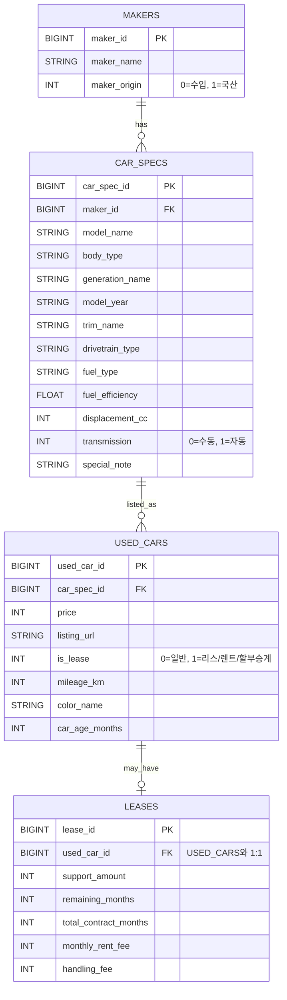

# 데이터 기반 중고차 구매 의사결정 지원 서비스

---

## 팀 구성

| 이름  | 역할                                                          |
|-----|-------------------------------------------------------------|
| 장한재 | 서비스 설계·데이터 분석·룰 기반 모델 설계·streamlit 구현·레포·브랜치 관리·문서화         |
| 박민선 |                                                             |
| 홍완기 | Streamlit layout 설계 및 구현                                    |
| 조동휘 | 웹 크롤링·스크래핑 기반 데이터 수집 파이프라인 구축, DB 구조 설계, Docker 기반 개발 환경 구성 |
| 임승현 | 개념모델링, 논리설계, 데이터적재, API 조사                                  |
| 윤찬호 | 웹크롤링 설계/구현, 데이터 수집/전처리/정제                                   |

---
## 실행 환경 (Environment)

- Python 3.10+
- MySQL 8.0+
- Streamlit 1.30+
- 주요 라이브러리: pandas, numpy, scikit-learn, matplotlib, sqlalchemy, pymysql

---
## 실행 방법 (How to Run)

> 팀원 코드(크롤링/스키마/적재)가 완성되면, 여기 실행 절차를 최종 버전으로 확정합니다.

### 0) 라이브러리 설치

```bash
pip install -r requirements.txt
```

### 1) DB 준비

- MySQL 실행
- 스키마 생성: `02_database_schema/`
- 데이터 적재/전처리: `03_data_pipeline/`

---

### 2) Streamlit 실행

```bash
cd 05_streamlit_app
streamlit run app.py
```

---

### 3) (필요 시) 환경변수 설정

- `.env.example`을 복사해 `.env`로 만들고 값을 입력합니다.
- 필요 변수: DB_HOST, DB_PORT, DB_USER, DB_PASSWORD, DB_NAME
---

## 구현 화면 (Demo)

본 서비스는 “가격 적정도 분석”과 “조건 기반 탐색 추천” 두 흐름으로 구성되어 있습니다.  
아래는 주요 서비스 화면입니다.

### 1) 초기 화면


> 서비스 진입 화면으로, 가격 적정도 분석과 추천/탐색 기능으로 이동할 수 있습니다.

---

### 2) 가격 적정도 분석 화면


> 선택한 모델군 내 유사 매물을 기반으로 기대가격을 산출하고, 분위수(Q1~Q3) 기준으로 가격 적정도를 판정합니다.

---

### 3) 추천 / 탐색 화면


> 예산·연식·주행거리 조건 기반 후보를 구성한 뒤, 환산주행거리와 가격 경쟁력을 반영한 가성비 점수로 추천합니다.

---

## 1. 프로젝트 개요

### 1.1 프로젝트 요약

본 프로젝트는 사용자가 구매를 고려 중인 중고차의 가격이 시장 기준에서 합리적인 수준인지 분석하고, 동일 조건 내에서 더 나은 선택 가능성이 존재하는지를 제시하는 데이터 기반 의사결정 지원 서비스이다.

기존 중고차 플랫폼은 매물 조회 및 단순 정렬 기능 중심으로 구성되어 있으며, 구매 의사결정 단계에서 필요한 해석 정보 제공에는 한계가 존재한다. 본 서비스는 이러한 한계를 보완하기 위해 **비교 가능한 유사 차량
군집을 구성하고**, 그 군집 내에서 **기대가격(비교 기준선)** 과 **가격차이(실제−기대)** 를 산출하여 해석을 제공하는 구조로 설계되었다.

또한 사용자가 차량을 아직 결정하지 못한 경우에도 활용할 수 있도록, 예산·연식·주행거리 기반의 **탐색/추천 흐름**을 별도로 구성하여 서비스의 활용 범위를 확장하였다.

---

### 1.2 문제 정의

중고차 구매자는 특정 차량을 선택한 이후에도 다음과 같은 불확실성을 경험한다.

- 현재 가격이 시장 대비 적정한가
- 동일 조건 대비 더 우수한 선택지가 존재하는가
- 구매 이후 가격 측면의 후회 가능성이 존재하는가

본 프로젝트는 위 세 가지 질문에 데이터 기반으로 답하는 것을 목표로 한다.

---

### 1.3 프로젝트 실행
#### 1.3.1 환경설정 파일 생성 및 확인
`mysql`폴더 안에 `.env`파일을 생성한 후에 아래의 예시대로 작성해야 한다.
```.env
MYSQL_ROOT_PASSWORD='DataBase Root계정 비밀번호'
MYSQL_DATABASE=used_car_db
TZ=Asia/Seoul
```

#### 1.3.2 docker-compose 실행
프로젝트 폴더의 최상단 위치에서 아래의 명령어를 실행한다.
```bash
docker-compose -p SKN26-1ST-1TEAM up 
```
- `-p SKN26-1ST-TEAM`: Docker Compose의 프로젝트 이름 지정
- 컨테이너, 네트워크, 저장소 이름이 SKN26-1ST-1TEAM_* 형태로 생성됨

정상적으로 실행되면 MySQL 컨테이너가 실행되고
`used_car_db`데이터베이스가 자동으로 초기화된다.

---

## 2. 서비스 설계 철학

본 서비스는 단순 조회 서비스가 아닌 의사결정 지원 시스템으로 설계되었다.

핵심 설계 원칙은 다음과 같다.

1. **비교 가능한 군집 내에서 판단한다.**
    - 가격 비교는 동일/유사 조건의 차량 집합을 기준으로 수행해야 해석이 가능하다.
2. **시장 감가 구조를 반영한다.**
    - 연식과 주행거리는 가격 감가의 핵심 요인이므로, 이를 유사도 거리 정의에 반영한다.
3. **설명 가능한 모델만 사용한다.**
    - 복잡한 모델보다 해석 가능한 거리 함수, 회귀, 분위수 기반 판정을 채택한다.
4. **결과는 직관적으로 제시한다.**
    - 사용자가 “내 차량이 분포에서 어디에 있는지”를 한눈에 이해하도록 시각화를 설계한다.
5. **대안 제시는 ‘최저가’가 아닌 ‘합리성’ 기준으로 정의한다.**
    - 단순 최저가는 상태 열화(연식/주행) 등으로 왜곡될 수 있으므로, 군집 내 기대가격 대비 효율로 대안을 정의한다.

---

## 3. 핵심 기능

| 구분        | 기능            | 설명                               |
|-----------|---------------|----------------------------------|
| 가격 적정도 분석 | 기대가격 대비 위치 판단 | 유사 차량 군집 기반 기대가격 산출 후 가격차이 분석    |
| 유사 군집 분석  | 동일 조건 매물 탐색   | 연식·주행거리 기반 유사도 거리로 군집 구성         |
| 시각화       | 가격차이 분포       | 히스토그램(구간색 + 기준선)으로 분포 내 위치 제시    |
| 대안 제시     | 합리적 매물 탐색     | 군집 내 가격차이가 더 낮은 매물 TOP3 제시       |
| 탐색 추천     | 가성비 매물 추천     | 예산/연식/주행 조건 기반 + 환산주행(연식 반영) 점수화 |

---

## 4. 시스템 아키텍처

```
보배드림 크롤링 → MySQL → Python 분석 → Streamlit 서비스
```

데이터 수집, 저장, 분석, 시각화 단계를 분리하여 확장성과 유지보수성을 확보하였다.

---

## 5. 데이터 수집 및 정제

### 5.1 데이터 출처

- 보배드림 중고차 매물 크롤링

### 5.2 수집 항목

- **차량 제원 관련**
    - 제조사
    - 모델명
    - 세대명
    - 트림(등급)
    - 연료 타입
    - 변속기
    - 구동 방식
    - 배기량 / 전비
    - 연비
- **매물 관련 (UsedCar)**
    - 가격
    - 주행거리
    - 연식(또는 최초 등록 연월)
    - 색상
    - 매물 링크(URL)
    - 리스 여부
    - 차령(개월)
- **리스 관련 (Lease, 선택)**
    - 승계지원금
    - 월 리스료
    - 잔여 계약 개월
    - 총 계약 개월

### 5.3 전처리

- **수치 정규화**
    - 가격, 주행거리, 배기량의 콤마 제거 및 정수 변환
    - 연비/전비 숫자 추출
    - 리스 금액 관련 문자열 → 숫자 변환

- **도메인 전처리**
    - 연식 → 차령(개월) 계산
    - 리스 여부 플래그(is_lease) 생성
    - 리스 매물만 Lease 데이터 분리

- **텍스트/범주 처리**
    -연료 타입 표준화 (예: 가솔린/휘발유 통합)
    - 변속기 표준화 (자동/수동)
    - 색상 명칭 정규화

- **데이터 품질**
    - 중복 매물 제거 (URL 기준)
    - 필수 컬럼 결측치만 제거

---

## 6. 데이터베이스 설계

### 6.1 개념 모델 설계

#### 요구 정의서

- 본 프로젝트는 중고차 데이터를 **제조사(Maker)–차량 제원(CarSpec)–매물(UsedCar)** 흐름으로 관리한다.
- **리스 정보는 일부 매물에서만 제공되는 부가 정보**이므로 Lease로 별도 관리한다.

#### 6.1.1 개념 엔티티 정의

- **제조사**: 차량을 **생산하는 주체**이다.   
  제조사를 식별하고 분류하기 위한 기준 정보를 대표한다.
- **차량 제원**: 차량 모델의 세대·트림을 포함한 **고정된 차량 특성**을 나타낸다.   
  연료 방식, 구동 방식 등 매물과 무관한 스펙 정보를 대표한다.
- **중고차 매물**: 실제로 거래되는 중고차 단위이다.   
  가격, 상태, 주행 이력 등 **매물마다 달라지는 정보를 대표**한다.
- **리스 정보**: 리스·렌트·할부 승계 매물에 한해 발생하는 계약 관련 부가 정보를 대표한다.   
  **일반 매물에는 존재하지 않는다.**

#### 6.1.2 개념 관계

- **제조사 1 : N 차량 제원**   
  하나의 제조사는 여러 차량 제원을 가질 수 있다.   
  차량 제원은 반드시 하나의 제조사에 속한다.
- **차량 제원 1 : N 중고차 매물**   
  하나의 차량 제원은 여러 중고차 매물로 등록될 수 있다.   
  각 매물은 하나의 차량 제원을 기준으로 한다.
- **중고차 매물 1 : 0..1 리스 정보**   
  리스 정보는 모든 매물에 존재하지 않는다.  
  리스/승계 매물에 한해 **선택적으로 연결**된다.

---

### 6.2 논리 모델 설계



중고차 데이터는 차량의 고정 제원과 매물별 변동 정보가 명확히 구분되는 도메인을 가진다.
이에 따라 제원 정보와 매물 정보를 분리하였다.
리스 정보는 선택적으로 존재하는 부가 정보로 설계하였다.

정규화 과정을 통해 **제조사(브랜드)와 차량 제원 정보를 분리**하여   
데이터 중복을 제거하고 **갱신•삭제 이상을 방지**하였다.

리스 정보는 모든 매물에 존재하지 않는 **선택적 데이터**이으로   
USED_CARS-LEASES 관계를 1:0..1로 모델링하였다.


---

### 6.3 물리 모델 설계

#### 6.3.1 데이터 베이스 ERD

](./docs/used_car_db.png)
> 차량의 고정 제원과 매물 정보를 분리하여 중복을 제거하였다.  
> 리스 정보는 일부 매물에만 존재하는 선택적 데이터이므로 별도 테이블로 설계하였다.

---

## 7. 데이터 파이프라인

```
크롤링
 → Raw 저장
 → 정규화
 → 분석 데이터셋 생성
 → 유사도 군집
 → 기대가격 산출
 → 시각화 서비스
```

---

## 8. 유사도 기반 군집화 모델 설계

본 프로젝트는 실제 중고차 매물 데이터를 기반으로 분석을 수행하였으나, 특정 모델 단위로 유사 군집을 구성할 경우 표본 수가 제한되는 문제가 존재하였다. 동일 브랜드·동일 모델을 기준으로 연식과 주행거리까지 유사한
조건을 동시에 만족하는 매물 수는 모델별로 큰 편차를 보였으며, 일부 군집에서는 회귀 계수를 안정적으로 추정하기에 충분한 표본을 확보하기 어려웠다.

일반적인 회귀 분석에서는 표본 수가 충분할 경우 데이터로부터 계수를 직접 추정하는 것이 바람직하지만, 본 프로젝트의 목적은 가격 ‘예측’이 아니라 유사 차량 간 비교 기준선 설정에 있다. 따라서 제한된 표본 규모
하에서 군집별 회귀 계수를 개별적으로 추정할 경우, 특정 군집의 표본 편향이 계수 왜곡으로 이어질 위험이 존재하였다.

이러한 한계를 보완하기 위해 본 프로젝트에서는 선행 연구에서 반복적으로 검증된 감가 계수 비율을 참조하여, 연식과 주행거리 간 상대적 감가 효과를 룰 기반 계수(rule-based coefficient) 형태로
채택하였다. 이는 데이터 제약 환경에서도 비교 기준선의 일관성과 안정성을 확보하기 위한 설계 판단에 따른 것이다.

해당 설계는 다음과 같은 근거에 기반한다.

1. 연구 문헌에서 일관되게 관측되는 감가 계수 비율 존재
2. 군집별 소표본 편향 위험 완화
3. 비교 기준선의 구조적 안정성 확보
4. 가격 ‘예측’이 아닌 ‘비교’ 목적에 부합

따라서 본 서비스의 회귀 모델은 데이터 기반 최적 계수 추정 모델이라기보다, 선행 연구 근거와 시장 감가 관행을 반영한 설명 가능한 기준선 생성 모델로 해석하는 것이 적절하다.

한편, 본 프로젝트에서 군집(cluster)은 통계적 비지도 학습 결과가 아닌, 시장 비교 가능성을 확보하기 위해 설계된 룰 기반 유사도 군집으로 정의된다. 중고차 감가 구조를 반영한 설명 가능한 유사도 거리 척도를
직접 설계함으로써, 서비스 사용자가 “왜 이 매물들이 비교군으로 구성되었는가”를 이해할 수 있도록 하였다.

### 8.1 군집(비교군) 구성 원칙

군집은 다음 조건을 만족하는 매물 집합으로 구성된다.

1) **동일 브랜드 및 동일 모델(대분류)**

- 입력 차량과 비교군이 모델 수준에서 일치해야 한다.
- 트림/옵션 표기 때문에 모델명이 과도하게 세분되는 문제를 완화하기 위해, 분석 키를 “대분류 모델(model_family)”로 구성한다.

2) **연식 및 주행거리 기반 ‘유사도’ 정렬**

- 동일 모델 내에서도 연식과 주행거리가 크게 다르면 가격 비교가 왜곡된다.
- 따라서 연식/주행거리 차이를 감가 단위로 환산한 거리(distance)를 정의하고, 이를 유사도(similarity)로 변환하여 가까운 차량일수록 군집의 핵심으로 작동하도록 한다.

3) **비교군 최소 크기 조건**

- 분포 기반 판정(Q1/Q3)을 안정적으로 수행하기 위해 비교군(군집) 매물 수가 일정 수준 이상이어야 한다.
- 본 서비스는 최소 10개 이상 비교군을 확보하는 것을 기본 조건으로 둔다(소표본 분포 왜곡 방지 목적).

### 8.2 군집화를 ‘설명 가능한 방식’으로 설계한 이유

- 구매 의사결정 서비스는 결과뿐 아니라 “근거”가 중요하다.
- 예측 정확도만 높고 해석이 어려운 모델은 사용자 신뢰를 확보하기 어렵다.
- 따라서 유사도 군집의 정의(브랜드/모델/연식/주행거리)와 가중치 근거(선행 연구)를 문서화하고, 서비스 화면에서 동일한 기준으로 일관되게 사용한다.

---

## 9. 연식–주행거리 가중치 설정 근거

선행 연구에 따르면:

Kihm and Vance(2016)는 중고차 가격 회귀 분석 결과를 통해 **연식 1년 증가 시 약 7.4%의 가격 하락**이 발생함을 보고하였으며, 동일 연구 및 이를 인용한 Doležalová(2020)는 *
*주행거리 10,000km 증가 시 약 3.3%의 가격 하락**이 발생함을 제시하였다. 이 두 추정치를 동일한 가격 하락 효과 기준으로 환산하면, 연식 1년의 효과는 주행거리 약 22,000km 증가에 해당한다(
7.4 ÷ 3.3 ≈ 2.24).

환산 결과:

```
연식 1년 ≈ 22,000km
```

이를 감가 단위로 적용하였다.

---

## 10. 거리 함수

```
distance =
|연식 차이| +
|주행거리 차이| / 22,000
```

---

## 11. 유사도 함수

```
similarity = exp(-distance)
```

---

## 12. 기대가격 모델

군집 내 회귀 분석:

```
Price = β0 + β1·Year + β2·Mileage
```

가격 예측이 아닌 비교 기준선 역할 수행.

---

## 13. 가격 적정도 판단

```
가격차이 = 실제 − 기대
```

- 가격차이(실제−기대)가 크면 같은 조건에서 상대적으로 비싼 매물로 해석된다.
- 가격차이 분포의 분위수(Q1/Q3)를 활용하여 “저평가/적정/고평가”를 판정한다.

| 구간    | 의미  | 해석                              |
|-------|-----|---------------------------------|
| Q1 이하 | 저평가 | 시장 대비 저렴, 협상 여지 상대적으로 작음(이미 저렴) |
| Q1~Q3 | 적정  | 시장 분포 내 일반 구간                   |
| Q3 이상 | 고평가 | 시장 대비 비쌈, 협상 또는 대안 탐색 권장        |

---

## 14. 대안 차량 제시 로직

선정 기준:

```
price_gap(매물) < price_gap(입력 차량)
```

상위 3개 매물 제시.

---

## 15. 추천 탐색 모델

```
환산주행거리 =
(연식 × 22,000) + 주행거리
```

---

#### ① 상태 지표: 환산주행거리

상태 평가는 앞서 정의한 환산주행거리를 기준으로 수행된다.  
환산주행거리가 낮을수록 연식과 주행 조건이 유리한 차량으로 해석되며, 상태 점수 산정의 기초 지표로 활용된다.

---

#### ② 가격 점수(Price Score)

후보군 내부 최소·최대 가격을 기준으로 Min-Max 정규화를 적용한다.

price_score =
1 − (가격 − 최소가격) / (최대가격 − 최소가격)

- 동일 후보군 최저가에 가까울수록 1에 근접
- 최고가에 가까울수록 0에 근접

이를 통해 절대 가격이 아닌, 동일 시장 대비 가격 경쟁력을 상대적으로 평가한다.

---

#### ③ 상태 점수(Condition Score)

환산주행거리에 대해서도 동일한 방식의 Min-Max 정규화를 적용한다.

condition_score =
1 − (환산주행거리 − 최소값) / (최대값 − 최소값)

- 환산주행거리가 낮을수록 1에 근접
- 높을수록 0에 근접

이를 통해 연식과 주행거리의 복합 상태를 하나의 점수로 환산한다.

---

#### ④ 최종 가성비 점수(Value Score)

가격 점수와 상태 점수를 가중 평균하여 최종 가성비 점수를 산출한다.
여기서 가중치 `w_price`, `w_condition`는 사용자가 설정한 구매 선호도에 따라 결정된다.
예를 들어,

- 가격 중심 구매자 → 가격 비중 증가
- 차량 상태 중시 → 상태 비중 증가

기본값은 50:50으로 설정되며, 사용자 인터페이스에서 슬라이더 형태로 조정 가능하다.

---

#### ⑤ 추천 산출 방식

최종적으로 계산된 `value_score`를 기준으로 내림차순 정렬하여  
가성비 상위 후보 차량을 추천한다.

따라서 추천 결과는 단순 최저가 차량이 아니라,  
동일 시장 조건 내에서 가격과 상태가 모두 유리한 차량을 중심으로 구성된다.

---

## 16. 시각화 설계(가격차이 히스토그램 중심)

본 서비스의 핵심 시각화는 가격차이(실제−기대) 분포 히스토그램이다.

- 구간색으로 “저평가/적정/고평가” 영역을 직관적으로 구분
- 기준선(내 차량) 표시로 분포 내 위치를 명확히 제시
- 중앙값 표시로 전체 분포 중심을 함께 제공

시각화는 “복잡한 지표”를 늘리기보다, 구매 의사결정에 직접적으로 연결되는 최소 핵심 지표를 명확히 보여주는 방향으로 설계하였다.

---

## 17. 서비스 UI 흐름

1. 차량 선택
2. 가격 분석
3. 적정도 판단
4. 대안 제시
5. 추천 탐색

---

## 18. GitHub 폴더 구조

본 프로젝트는 데이터 수집부터 분석·서비스 구현까지의 전체 파이프라인이 단계별로 구분되도록 폴더를 구성하였다.

```
project/
├─ 01_crawling/           # 보배드림 매물 크롤링
│
├─ 02_database_schema/   # MySQL 테이블 생성 및 ERD 기반 스키마
│
├─ 03_data_pipeline/     # Python 데이터 적재 및 전처리 및 DB로드
│
├─ 04_algorithm/         # 유사도 군집·기대가격·가성비 알고리즘
│
├─ 05_streamlit_app/     # Streamlit 서비스 UI
│
└─ README.md
```

---

## 19. 프로젝트 차별성

- **의사결정 지원 중심 설계**  
  단순 매물 조회·정렬이 아닌, 구매 판단에 필요한 해석 정보(기대가격·가격차이·분위수 판정·대안 제시)를 제공하는 의사결정 지원 구조로 설계하였다.

- **연구 기반 감가 가중치 적용**  
  연식과 주행거리의 상대적 감가 효과를 선행연구 계수 비율을 통해 환산하여, 시장 감가 구조를 반영한 유사도 거리와 기준선 모델을 설계하였다.

- **설명 가능한 분석 모델**  
  복잡한 블랙박스 예측 모델이 아닌, 유사도 거리 함수·선형 기준선·분위수 판정 기반의 해석 가능한 분석 구조를 채택하였다.

- **유사 군집 기반 비교 체계**  
  동일 브랜드·모델(대분류)과 유사 연식·주행 조건을 기준으로 비교군을 구성하여, 비교 가능성이 확보된 시장 내부에서 가격 판단이 이루어지도록 설계하였다.

- **대안 차량 제시 기능 포함**  
  입력 차량 대비 기대가격 효율이 높은 매물을 동일 군집 내에서 탐색하여, 구매 의사결정 시 대체 선택지를 함께 제시한다.

---

## 20. 한계점

- **옵션(트림/사양) 반영 한계**  
  차량 옵션 및 세부 트림 정보는 가격에 큰 영향을 미치지만, 텍스트 비정형 데이터 특성상 완전한 정규화·정량화 반영이 어려웠다.

- **사고·정비 이력 미반영**  
  사고 이력, 정비 상태, 차량 관리 수준 등 비정형 품질 요소는 데이터 수집 범위에 포함되지 않아 가격 비교에 직접 반영되지 못했다.

- **단일 플랫폼 데이터 편향**  
  특정 중고차 플랫폼 데이터에 기반하여 분석이 수행되었기 때문에, 시장 전체 시세를 완전히 대표하지 못할 가능성이 존재한다.

- **지역별 시세 차이 미반영**  
  동일 모델이라도 지역별 수요·공급에 따라 가격 차이가 발생할 수 있으나, 본 프로젝트에서는 이를 주요 비교 변수로 반영하지 않았다.

- **표본 수 부족에 따른 군집 불균형**  
  일부 모델군에서는 유사 조건 매물 수가 제한되어, 군집 기반 기준선 추정의 안정성이 낮아질 가능성이 존재한다.

- **룰 기반 계수의 일반화 한계**  
  감가 가중치는 선행연구 기반 합리적 근사치이지만, 특정 차종·시장 상황에 따라 실제 감가 구조와 차이가 발생할 수 있다.

---

## 21. 확장 방향

- **옵션(트림·사양) 정보 반영**  
  차량 옵션 및 트림 세부 사양을 텍스트 파싱 또는 사전 매핑을 통해 정규화하여, 동일 모델 내 가격 차이를 보다 정교하게 설명할 수 있는 비교 기준을 확장할 수 있다.

- **지역별 가격 차이 반영**  
  매물 등록 지역 또는 권역 단위 시세 차이를 반영하여, 동일 차량이라도 지역 수요·공급 구조에 따른 가격 편차를 분석 지표에 포함할 수 있다.

- **비선형 가격 예측 모델 도입**  
  Gradient Boosting, Random Forest, 딥러닝 기반 회귀 모델 등 비선형 가격 예측 모델을 적용하여, 룰 기반 기준선과의 성능 비교 및 보완 분석을 수행할 수 있다.

- **옵션·사고 이력 통합 품질 지표 구축**  
  사고 이력, 정비 기록, 보험 이력 등 차량 품질 데이터를 결합하여, 단순 가격 비교를 넘어 차량 상태까지 반영한 종합 가치 평가 모델로 확장할 수 있다.

- **데이터 소스 확장 및 표본 수 증대**  
  복수 중고차 플랫폼 데이터를 통합 수집함으로써 표본 편향을 완화하고, 모델·연식·주행 조건별 군집 안정성을 강화할 수 있다.

- **협상 가이드 자동 생성 기능**  
  가격차이 및 군집 분포 정보를 기반으로, 구매자가 실제 협상 시 활용할 수 있는 근거 문장을 자동 생성하는 기능으로 확장 가능하다.

---

---

## 22. 프로젝트 팀원 회고

본 프로젝트 수행 과정에서 팀원 간 협업 경험과 기여도를 상호 평가하기 위해 회고를 기록한다.  
평가 내용은 자유롭게 작성하며, 프로젝트 기여·협업·문제해결·리더십 등을 중심으로 기술한다.

---

### 장한재

| 평가자 | 회고 내용                                                                                                                                                                      |
|-----|----------------------------------------------------------------------------------------------------------------------------------------------------------------------------|
| 박민선 |                                                                                                                                                                            |
| 홍완기 | 아이디어와 주제선정 그리고 프로젝트의 모든 과정을 이끌어 주고 차별적인 프로젝트가 되도록 추진하여 끝까지 모두가 도움이 될수 있도록 해서 원활히 마무리 된거 같습니다.                                                                              |
| 조동휘 | 프로젝트에서 아이디어 구상과 데이터를 구할 때 이용할 사이트를 사전에 알아보는 작업을 해주셔서 프로젝트의 가장 어려운 부분을 빠르게 해결 했으며 역할 분담을 도맏아서 진행을 해주셔서 미듬직 하셨습니다. 또한 다른 팀원들이 꺼려하는 부분을 솔선수범으로 맡으셔서 감사했습니다.                   |
| 임승현 | 진행이 더뎌지거나 막히는 부분이 생길 때면 주도적으로 이슈를 해결해주셨습니다. Github, Streamlit, 발표 등 프로젝트가 외부적으로 잘 표현되고 보여지는데 많은 기여들을 해주셨고 가이드라인 제시 등 전반적인 흐름을 제시해주신 덕에 프로젝트가 원활히 진행될 수 있었습니다.              |
| 윤찬호 | 전반적인 서비스 설계 과정에서 사용자 관점과 데이터 활용 관점을 함께 고려한 아이디어를 지속적으로 제안해주셔서 방향을 잡는 데 큰 도움이 되었습니다. 팀장은 따로 정하지 않았지만, 결정이 어려울 때 먼저 나서서 핵심 쟁점을 정리하고 대안을 제시해주셔서 프로젝트가 전반적으로 원활하게 굴러갈 수 있었습니다. |

---

### 박민선 회고

| 평가자 | 회고 내용                                                                                                                    |
|-----|--------------------------------------------------------------------------------------------------------------------------|
| 장한재 | 학회를 가야되는외부일정이 불가피한 상황에서도 ppt 제작 등 맡은바를 완수해주셔서 좋았습니다.                                                                     |
| 홍완기 | 바쁜시간속에서도 끝까지 맡은 것을 마무리 하려는 모습이 좋았습니다.                                                                                    |
| 조동휘 | 일정 때문에 본 프로젝트에서 PPT를 담당해 주셔서 매우 고맙고 제일 중요한 부분을 책임을 지시는 거 같아서 이것만으로도 큰 도움이 되면서 감사하게 생각하고 있습니다. 다음에는 같이 프로젝트를 진행했으면 좋겠습니다. |
| 임승현 | 깔끔하고 핵심적인 내용 위주의 PPT자료를 준비해주셨고 외부 일정에도 불구하고 프로젝트가 차질 없이 진행되도록 적절한 시기에 참여와 역할을 해주셨습니다.                                    |
| 윤찬호 | 일정때문에 프로젝트 진행 당시 참여를 못하는 일정에도 불구하고 프로젝트간 진행한 내용을 잘 정리해주시고 발표를 위한 PPT 작성을 맡아주셨습니다.                                        |

---

### 홍완기 회고

| 평가자 | 회고 내용                                                                                                                                                                                         |
|-----|-----------------------------------------------------------------------------------------------------------------------------------------------------------------------------------------------
| 장한재 | streamlit 작동 방식을 스스로 배우시면서 UI/UX를 고려한 streamlit 뼈대와 탐색 부분의 아이디어와 제작을 해주셔서 좋았습니다.                                                                                                              |
| 박민선 |                                                                                                                                                                                               |
| 조동휘 | Streamlit을 프로젝트에서 출력하는 부분을 놓칠 수 있는 부분을 찾아내주셔서 프로젝트의 서비스 목적에서 엇나가지 않게 큰 도움이 되셨습니다. 또한 중간마다 너무 깊게 개발이 되려고 하면 깊이를 조절할 수 있게 도움이 되셨습니다.                                                            |
| 임승현 | Streamlit을 프로젝트 목적에 맞게 구현해주셨고 UI/UX를 고려한 기능 편성과 진행중에도 데이터 상태를 수시로 모니터링 하고 소통하시며 프로젝트의 취지를 잘 살려주셨습니다.                                                                                          |
| 윤찬호 | Streamlit을 활용해 수집한 데이터를 바탕으로 핵심 지표와 결과를 보기 좋게 시각화해주셔서, 팀원들이 현재 데이터 상태와 인사이트를 빠르게 파악할 수 있었습니다. 또한 작업 중간중간 도움이 필요한 부분이 없는지 먼저 확인해주시는 등 전반적으로 커뮤니케이션과 참여도가 높아 팀 분위기를 끌어올리고 프로젝트 진행에도 큰 힘이 되었습니다. |

---

### 조동휘 회고

| 평가자 | 회고 내용                                                                                                                                                      |
|-----|------------------------------------------------------------------------------------------------------------------------------------------------------------|
| 장한재 | sql 테이블 제작과 적재 등 데이터베이스와 관련된 소임을 책임지고 열심히 해주셔서 프로젝트를 하는 내내 든든한 아군이었습니다.                                                                                    |
| 박민선 |                                                                                                                                                            |
| 홍완기 | 바로 옆에서 모르는것과 새로운 것들을 물어볼수 있었고 프로젝트중 SQL 크롤링 등 굵은 문제들을 해결하는 모습이 좋았습니다.                                                                                      |
| 임승현 | 데이터베이스 구축 전반을 관리해주시며 모델링, ERD설계, 논리설계, 도메인분리 등을 주도적으로 진행해주셨습니다. 기초 데이터 설계를 해주신 덕에 프로젝트 방향과 진행이 명확해질수있었고 db 연계 등 중요 문제 부분들에서 솔루션을 제시해주신 덕에 원활한 진행이 가능하였습니다. |
| 윤찬호 | ERD 설계 과정에서 관계 설정이나 키 정의와 같이 헷갈리는 구간을 먼저 짚어주시고 도와주셔서 큰 도움이 되었습니다. 의견 교환시 적극적으로 의견을 말씀해주셔서 프로젝트 진행에 많은 도움이 된 것 같습니다.                                        |

---

### 임승현 회고

| 평가자 | 회고 내용                                                                                                                                       |
|-----|---------------------------------------------------------------------------------------------------------------------------------------------|
| 장한재 | 데이터 전처리와 적재에 관해 도움을 주면서 열심히 하시는 모습이 좋았습니다.                                                                                                  |
| 박민선 |                                                                                                                                             |
| 홍완기 | 이번 프로젝트에서 크롤링에 대한 기능과 세부 내용들을 확인해주시는 것들이 디테일을 높이는데 도움이되었습니다.                                                                                |
| 조동휘 | 어려운 내용인 API의 연결 방법과 사용 방법 분석을 부탁드렸는데 유의미한 결과를 만들 수 있게 도움이되었습니다. 데이터 전처리 과정에서 같은 팀원인 윤찬호님을 도우며 전처리 과정이 빠르게 진행되게 도움을 주셨습니다.                   |
| 윤찬호 | 사용 가능한 API를 직접 탐색하고 비교해 프로젝트 요구사항에 맞는 데이터 소스를 빠르게 확보해주셨고, 수집한 데이터를 DB에 적재하는 과정도 진행해주셨습니다. 여러 역할을 유연하게 수행해 주셔서 프로젝트 진행 속도와 완성도에 모두 도움이 되었습니다 |

---

### 윤찬호 회고

| 평가자 | 회고 내용                                                                                                                                                      |
|-----|------------------------------------------------------------------------------------------------------------------------------------------------------------|
| 장한재 | 웹 크롤링과 전처리등 데이터를 다루는 데에 열심히 해주셨고 그로 인해 성공적인 프로젝트가 되었습니다.                                                                                                   |
| 박민선 |                                                                                                                                                            |
| 홍완기 | 프로젝트의 중심인 웹 크롤링을 빠르고 정확하게 해주셔서 원활한 프로젝트가 되었습니다.                                                                                                            |
| 조동휘 | 데이터베이스 설계 및 데이터 파이프라인 구축에 큰 도움이 되었으며 전처리(Data Processing) 과정을 도맡아서 개발을 진행해 주었습니다.                                                                          |
| 임승현 | 데이터베이스 구축을 주도, 실행하며 데이터베이스 전반을 관리해주셨습니다. 전처리(Data Processing) 과정에서 조원들과 협업을 통해 프로젝트 목적에 맞는 데이터를 수집,분석,가공을 해주셨고 기술적 이해를 바탕으로 원활한 프로젝트가 진행되도록 여러 기여를 해주셨습니다. |

---

## 결론

본 서비스는 시장 비교 기반 분석을 통해 중고차 구매 의사결정을 지원하는 데이터 기반 분석 시스템이다.  
특히 동일 브랜드·모델 내 유사 차량 군집을 구성하고, 연식과 주행거리를 반영한 기대가격 기준선을 생성하여 입력 차량의 가격 위치를 해석 가능하게 제시한다.

또한 가격차이 분포와 분위수 판정을 통해 “적정·저평가·고평가”를 직관적으로 제시하고, 동일 군집 내 더 합리적인 대안 차량을 함께 탐색할 수 있도록 설계하였다.

이는 단순 매물 조회를 넘어, 구매 판단에 필요한 비교 기준과 해석 근거를 제공한다는 점에서 의사결정 지원 서비스로서의 가치를 가진다.

## 제출 안내

본 브랜치(final)는 프로젝트 최종 제출용 코드 및 문서만을 포함합니다.

개발 과정 및 협업 이력은 https://github.com/rusidian/team_flex_used_car.git의 main, develop 브랜치에서 확인할 수 있습니다.


