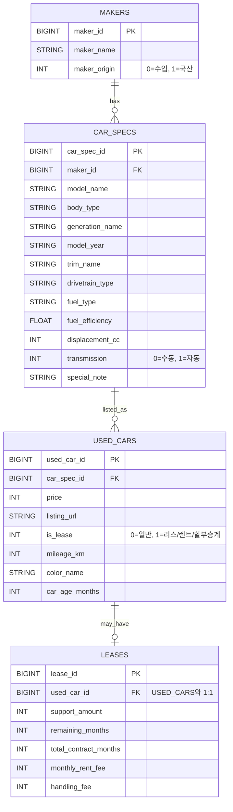

# 데이터 기반 중고차 구매 의사결정 지원 서비스

---

## 팀 구성

| 이름  | 역할                                  |
|-----|-------------------------------------|
| 장한재 | 웹크롤링·데이터 분석 · 서비스 설계 · Streamlit 구현 |
| 박민선 |                                     |
| 홍완기 |                                     |
| 조동휘 | 웹크롤링·웹 스크래핑·DB 설계 ·Docker 설계 및 운영   |
| 임승현 |                                     |
| 윤찬호 |                                     |

---

## 1. 프로젝트 개요

### 1.1 프로젝트 요약

본 프로젝트는 사용자가 구매를 고려 중인 중고차의 가격이 시장 기준에서 합리적인 수준인지 분석하고, 동일 조건 내에서 더 나은 선택 가능성이 존재하는지를 제시하는 데이터 기반 의사결정 지원 서비스이다.

기존 중고차 플랫폼은 매물 조회 및 단순 정렬 기능 중심으로 구성되어 있으며, 구매 의사결정 단계에서 필요한 해석 정보 제공에는 한계가 존재한다. 본 서비스는 이러한 한계를 보완하기 위해 비교·분석·해석 중심 구조로
설계되었다.

---

### 1.2 문제 정의

중고차 구매자는 특정 차량을 선택한 이후에도 다음과 같은 불확실성을 경험한다.

- 현재 가격이 시장 대비 적정한가
- 동일 조건 대비 더 나은 선택지가 존재하는가
- 구매 이후 가격 측면의 후회 가능성이 존재하는가

본 프로젝트는 위 세 가지 질문에 데이터 기반으로 답하는 것을 목표로 한다.

---

### 1.3 프로젝트 실행
#### 1.3.1 환경설정 파일 생성 및 확인
`mysql`폴더 안에 `.env`파일을 생성한 후에 아래의 예시대로 작성해야 한다.
```.env
MYSQL_ROOT_PASSWORD='DataBase Root계정 비밀번호'
MYSQL_DATABASE=used_car_db
TZ=Asia/Seoul
```

#### 1.3.2 docker-compose 실행
프로젝트 폴더의 최상단 위치에서 아래의 명령어를 실행한다.
```bash
docker-compose -p SKN26-1ST-1TEAM up 
```
- `-p SKN26-1ST-TEAM`: Docker Compose의 프로젝트 이름 지정
- 컨테이너, 네트워크, 저장소 이름이 SKN26-1ST-1TEAM_* 형태로 생성됨

정상적으로 실행되면 MySQL 컨테이너가 실행되고
`used_car_db`데이터베이스가 자동으로 초기화된다.

## 2. 서비스 설계 철학

본 서비스는 단순 조회 서비스가 아닌 의사결정 지원 시스템으로 설계되었다.

핵심 설계 원칙은 다음과 같다.

1. 비교 가능한 군집 내에서 판단한다.
2. 시장 감가 구조를 반영한다.
3. 해석 가능한 모델만 사용한다.
4. 결과는 시각적으로 직관적으로 제시한다.

---

## 3. 핵심 기능

| 구분        | 기능            | 설명              |
|-----------|---------------|-----------------|
| 가격 적정도 분석 | 기대가격 대비 위치 판단 | 시장 가격 대비 적정성 평가 |
| 유사 군집 분석  | 동일 조건 매물 탐색   | 연식·주행거리 기반      |
| 시각화       | 가격차이 분포       | 히스토그램           |
| 대안 제시     | 합리적 매물 탐색     | 군집 내 가격 효율 비교   |
| 추천 탐색     | 가성비 매물 추천     | 환산주행 기반         |

---

## 4. 시스템 아키텍처

```
보배드림 크롤링 → MySQL → Python 분석 → Streamlit 서비스
```

데이터 수집, 저장, 분석, 시각화 단계를 분리하여 확장성과 유지보수성을 확보하였다.

---

## 5. 데이터 수집 및 정제

### 5.1 데이터 출처

- 보배드림 중고차 매물 크롤링

### 5.2 수집 항목
-  차량 제원 관련
   - 제조사 
   - 모델명
   - 세대명
   - 트림(등급)
   - 연료 타입
   - 변속기
   - 구동 방식
   - 배기량 / 전비
   - 연비
- 매물 관련 (UsedCar)
  - 가격
  - 주행거리
  - 연식(또는 최초 등록 연월)
  - 색상
  - 매물 링크(URL)
  - 리스 여부
  - 차령(개월)
- 리스 관련 (Lease, 선택)
  - 승계지원금
  - 월 리스료
  - 잔여 계약 개월
  - 총 계약 개월

### 5.3 전처리
- 수치 정규화
  - 가격, 주행거리, 배기량의 콤마 제거 및 정수 변환
  - 연비/전비 숫자 추출
  - 리스 금액 관련 문자열 → 숫자 변환

- 도메인 전처리
  - 연식 → 차령(개월) 계산
  - 리스 여부 플래그(is_lease) 생성
  - 리스 매물만 Lease 데이터 분리

- 텍스트/범주 처리
  -연료 타입 표준화 (예: 가솔린/휘발유 통합)
  - 변속기 표준화 (자동/수동)
  - 색상 명칭 정규화

- 데이터 품질 
  - 중복 매물 제거 (URL 기준)
  - 필수 컬럼 결측치만 제거

---

## 6. 데이터베이스 설계

### 6.1 개념 모델 설계
#### 요구 정의서
- 본 프로젝트는 중고차 데이터를 **제조사(Maker)–차량 제원(CarSpec)–매물(UsedCar)** 흐름으로 관리한다.
- **리스 정보는 일부 매물에서만 제공되는 부가 정보**이므로 Lease로 별도 관리한다.

#### 6.1.1 개념 엔티티 정의
- **제조사**: 차량을 **생산하는 주체**이다.   
  제조사를 식별하고 분류하기 위한 기준 정보를 대표한다.
- **차량 제원**: 차량 모델의 세대·트림을 포함한 **고정된 차량 특성**을 나타낸다.   
  연료 방식, 구동 방식 등 매물과 무관한 스펙 정보를 대표한다.
- **중고차 매물**: 실제로 거래되는 중고차 단위이다.   
가격, 상태, 주행 이력 등 **매물마다 달라지는 정보를 대표**한다.
- **리스 정보**: 리스·렌트·할부 승계 매물에 한해 발생하는 계약 관련 부가 정보를 대표한다.   
  **일반 매물에는 존재하지 않는다.**

#### 6.1.2 개념 관계
- **제조사 1 : N 차량 제원**   
  하나의 제조사는 여러 차량 제원을 가질 수 있다.   
  차량 제원은 반드시 하나의 제조사에 속한다.
- **차량 제원 1 : N 중고차 매물**   
  하나의 차량 제원은 여러 중고차 매물로 등록될 수 있다.   
  각 매물은 하나의 차량 제원을 기준으로 한다.
- **중고차 매물 1 : 0..1 리스 정보**   
  리스 정보는 모든 매물에 존재하지 않는다.  
  리스/승계 매물에 한해 **선택적으로 연결**된다.

---

### 6.2 논리 모델 설계



중고차 데이터는 차량의 고정 제원과 매물별 변동 정보가 명확히 구분되는 도메인을 가진다.
이에 따라 제원 정보와 매물 정보를 분리하였다.
리스 정보는 선택적으로 존재하는 부가 정보로 설계하였다.

정규화 과정을 통해 **제조사(브랜드)와 차량 제원 정보를 분리**하여   
데이터 중복을 제거하고 **갱신•삭제 이상을 방지**하였다.

리스 정보는 모든 매물에 존재하지 않는 **선택적 데이터**이으로   
USED_CARS-LEASES 관계를 1:0..1로 모델링하였다.

---

### 6.3 물리 모델 설계

#### 6.3.1 데이터 베이스 ERD

> 차량의 고정 제원과 매물 정보를 분리하여 중복을 제거하였다.  
> 리스 정보는 일부 매물에만 존재하는 선택적 데이터이므로 별도 테이블로 설계하였다.

---

## 7. 데이터 파이프라인

```
크롤링
 → Raw 저장
 → 정규화
 → 분석 데이터셋 생성
 → 유사도 군집
 → 기대가격 산출
 → 시각화 서비스
```

---

## 8. 유사도 군집 모델

동일 모델 기준 매물을 대상으로 다음 변수 차이를 활용한다.

- 연식
- 주행거리

---

## 9. 연식–주행거리 가중치 설정 근거

선행 연구에 따르면:

- 연식 1년 증가 → 약 7.4% 가격 하락
- 주행거리 10,000km 증가 → 약 3.3% 가격 하락

환산 결과:

```
연식 1년 ≈ 22,000km
```

이를 감가 단위로 적용하였다.

---

## 10. 거리 함수

```
distance =
|연식 차이| +
|주행거리 차이| / 22,000
```

---

## 11. 유사도 함수

```
similarity = exp(-distance)
```

---

## 12. 기대가격 모델

군집 내 회귀 분석:

```
Price = β0 + β1·Year + β2·Mileage
```

가격 예측이 아닌 비교 기준선 역할 수행.

---

## 13. 가격 적정도 판단

```
가격차이 = 실제 − 기대
```

| 구간    | 의미  |
|-------|-----|
| Q1 이하 | 저평가 |
| Q1~Q3 | 적정  |
| Q3 이상 | 고평가 |

---

## 14. 대안 차량 제시 로직

선정 기준:

```
price_gap(매물) < price_gap(입력 차량)
```

상위 3개 매물 제시.

---

## 15. 추천 탐색 모델

```
환산주행거리 =
(연식 × 22,000) + 주행거리
```

---

## 16. 시각화 설계

- 가격차이 히스토그램
- 내 차량 위치 표시
- 중앙값 표시

---

## 17. 서비스 UI 흐름

1. 차량 선택
2. 가격 분석
3. 적정도 판단
4. 대안 제시
5. 추천 탐색

---

## 18. GitHub 폴더 구조

```
project/
├─ analysis/
├─ streamlit/
├─ data/
├─ crawler/
└─ README.md
```

---

## 19. 프로젝트 차별성

- 의사결정 지원 중심 설계
- 연구 기반 감가 가중치
- 설명 가능한 모델

---

## 20. 한계점

- 옵션 반영 한계
- 사고 이력 미반영

---

## 21. 확장 방향

- 옵션 반영
- 지역 가격 반영
- 딥러닝 가격모델

---

## 결론

본 서비스는 시장 비교 분석을 통해 중고차 구매 의사결정을 지원하는 데이터 기반 분석 시스템이다.
