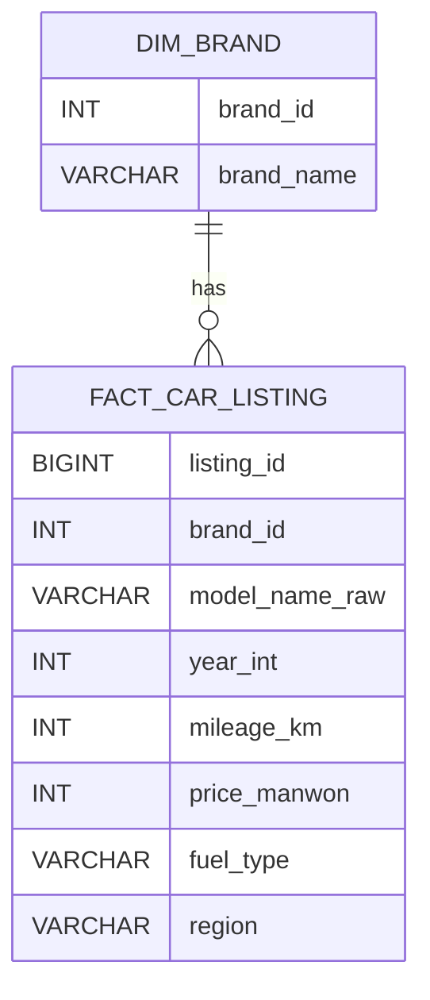

# 데이터 기반 중고차 구매 의사결정 지원 서비스

---

## 1. 프로젝트 개요

### 프로젝트 요약

본 프로젝트는 사용자가 선택한 중고차의 가격이 시장 대비 합리적인 수준인지 분석하고, 동일 조건 내에서 더 나은 선택 가능성이 존재하는지를 제시하는 데이터 기반 의사결정 지원 서비스이다.

기존 중고차 플랫폼이 매물 조회 및 단순 정렬 기능 중심으로 구성되어 있는 반면, 본 서비스는 구매 의사결정 단계에서 필요한 해석 정보 제공에 초점을 둔다.

---

### 기획 배경

중고차 구매자는 특정 차량을 선택한 이후에도 다음과 같은 불확실성을 경험한다.

- 현재 가격이 시장 대비 적정한 수준인지 여부
- 동일 조건 대비 더 우수한 선택지가 존재하는지 여부
- 구매 이후 가격 측면의 후회 가능성

기존 서비스는 가격, 연식, 주행거리 기준의 정렬 기능만 제공하며, 구매 판단을 위한 비교 해석 정보를 제공하지 않는다.

본 프로젝트는 이러한 정보 공백을 해소하기 위해 설계되었다.

---

## 2. 핵심 기능

| 구분 | 기능 | 설명 |
|------|------|------|
| 가격 적정도 분석 | 기대가격 대비 위치 판단 | 시장 가격 대비 적정성 평가 |
| 유사 군집 분석 | 동일 조건 매물 탐색 | 연식·주행거리 기반 |
| 시각화 | 가격차이 분포 | 히스토그램 |
| 대안 제시 | 합리적 매물 탐색 | 군집 내 가격 효율 비교 |
| 탐색 추천 | 가성비 매물 추천 | 환산주행 기반 |

---

## 3. 시스템 아키텍처

```
웹 크롤링 → MySQL → Python 분석 → Streamlit 서비스
```

데이터 수집, 저장, 분석, 시각화 단계를 분리하여 확장성과 재현성을 확보하였다.

---

## 4. 데이터베이스 구조



---

## 5. 데이터 파이프라인

```
웹 크롤링
 → Raw 데이터 저장
 → 정규화
 → 분석 데이터셋 생성
 → 유사도 군집 형성
 → 기대가격 산출
 → 서비스 시각화
```

---

## 6. 분석 로직 설계

### 유사도 군집

동일 모델을 기준으로 다음 변수 차이를 활용하여 군집을 구성한다.

- 연식 차이
- 주행거리 차이

---

## 7. 연식–주행거리 가중치 설정 근거

중고차 가격 결정 요인에 관한 선행 연구에서는 연식과 주행거리가 가격 하락에 가장 큰 영향을 미치는 변수로 반복적으로 보고된다.

로그 가격(Log Price)을 종속변수로 한 회귀 분석 결과를 통해 두 변수의 상대적 감가 효과를 비교할 수 있다.

### 연구 결과

- 연식 1년 증가 시 약 7.4% 가격 하락
- 주행거리 10,000km 증가 시 약 3.3% 가격 하락

이를 동일 감가 효과 기준으로 환산하면 다음과 같다.

```
7.4 ÷ 3.3 ≈ 2.24
```

즉,

> 연식 1년 ≈ 주행거리 약 22,000km 증가 효과

---

### 프로젝트 적용 방식

본 프로젝트는 위 연구 결과를 기반으로 다음과 같은 감가 단위를 적용하였다.

```
연식 1년 = 주행거리 22,000km
```

이는 특정 차종에 과적합되지 않으면서도 학술 연구 계수 비율과 일관된 보수적 근사치이다.

---

### 유사도 거리 정의

```
distance =
|연식 차이| +
|주행거리 차이| / 22,000
```

이를 지수 함수로 변환하여 유사도를 산출한다.

```
similarity = exp(-distance)
```

본 가중치는 가격 예측이 아닌 유사 차량 간 상대적 거리 측정 목적의 비교 척도로 사용된다.

---

### 참고 문헌

- Kihm, A., & Vance, C. (2016)  
- Doležalová, M. (2020)

---

## 8. 기대가격 모델

유사 군집 내 매물을 활용하여 선형 회귀 기반 기대가격을 산출한다.

```
Price = β0 + β1·Year + β2·Mileage
```

해당 회귀는 가격 예측이 아닌 군집 내 비교 기준선 역할을 수행한다.

---

## 9. 가격 적정도 판단

```
가격차이 = 실제가격 − 기대가격
```

| 구간 | 해석 |
|------|------|
| Q1 이하 | 저평가 |
| Q1~Q3 | 적정 |
| Q3 이상 | 고평가 |

---

## 10. 대안 차량 제시 로직

대안 차량은 단순 최저가가 아닌 다음 기준으로 선정된다.

> 동일 유사 군집 내에서 입력 차량보다 가격 효율이 높은 매물

선정 조건:

```
price_gap(매물) < price_gap(입력 차량)
```

이 중 상위 3개 매물을 대안으로 제시한다.

---

## 11. 추천 탐색 모델

### 환산주행거리

```
환산주행거리 =
(연식 × 22,000) + 실제 주행거리
```

### 가성비 점수

- 가격 경쟁력
- 차량 상태

복합 점수 기반 추천 수행.

---

## 12. 서비스 UI 구성

### 가격 적정도 분석

- 차량 조건 입력
- 기대가격 산출
- 가격 위치 시각화
- 대안 차량 제시

### 추천 탐색

- 조건 기반 필터
- 가성비 순 추천
- 분포 시각화

---

## 13. 프로젝트 차별점

- 의사결정 지원 중심 서비스
- 연구 기반 감가 가중치 적용
- 설명 가능한 통계 모델
- 머신러닝 의존 최소화 구조

---

## 14. 기대 효과 및 발전 방향

### 기대 효과

- 구매 판단 시간 단축
- 가격 협상 근거 제공
- 구매 후 후회 가능성 감소

### 발전 방향

- 옵션 반영 모델 확장
- 지역 가격 편차 반영
- 비선형 가격 모델 도입

---

## 15. 팀 구성

(최종 팀원 역할 기재)

---

## 결론

본 서비스는 중고차 구매 과정에서 발생하는 가격 판단 불확실성을 해소하기 위해 설계된 데이터 기반 의사결정 지원 시스템으로, 시장 비교 분석을 통해 합리적 구매 판단을 지원한다.
